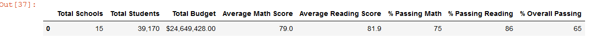
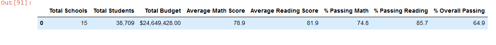

# School_District_Analysis
### Oveview of the school district analysis
  The purpose of this analysis was to assist Maria of the school board in analyzing various CSV files about students and schools using pandas in jupyter notebook to better manage data efficiently. In the initial analysis I was able to merge two different CSV files into one and continue formatting the data into more focused dataframes. However Maria has asked me to clean up some of the finished data seeing that there was instances of scholastic dishonesty among 9th graders in Thomas High School. In the following sections I go over how I cleaned the data and provided a new and accurate dataframe.

  ### Results :
  
  1. The district summary was largely left unchanged after removing all the of 9th graders scores from Thomas High school. This could be in part that there were only 431 students whose scores were left out out of the 40,000+ overall students left in the analysis, making it so that the number of affected students was too small to make an impact on the overall district.
##### District Summary for the schools before removing the affected students

##### The new District Summary after removing the affected students.

  
  
  2.The S

