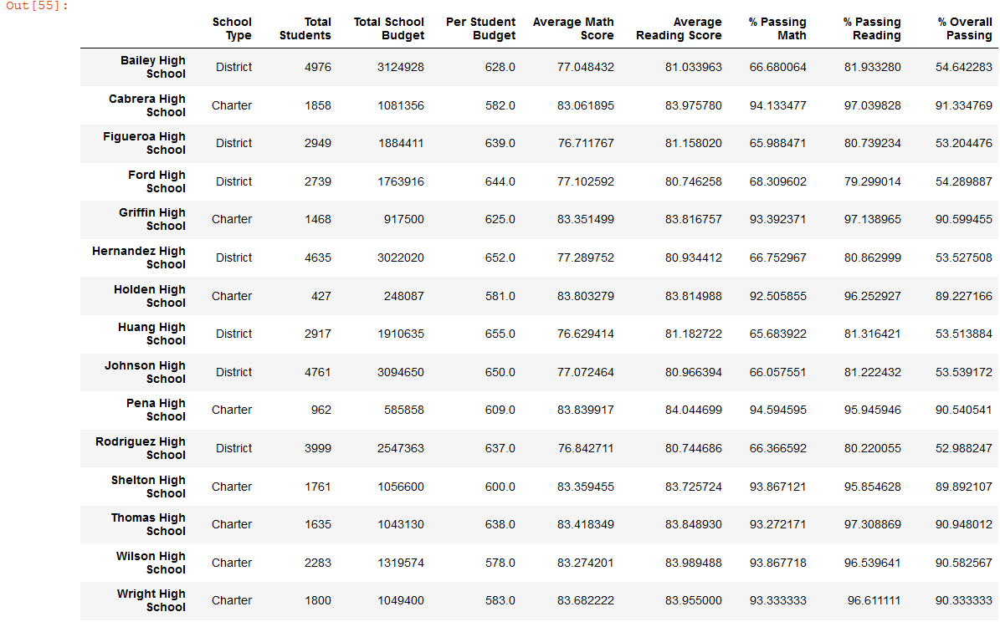
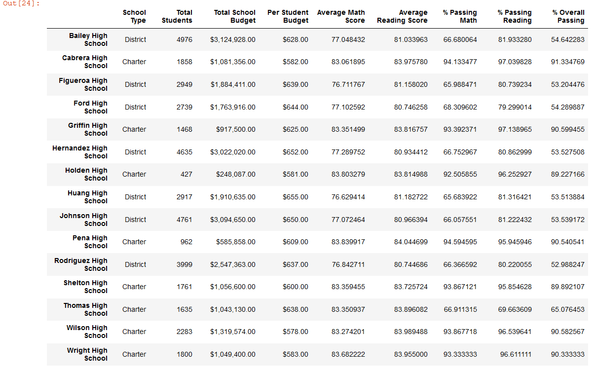

# School_District_Analysis
### Oveview of the school district analysis
  The purpose of this analysis was to assist Maria of the school board in analyzing various CSV files about students and schools using pandas in jupyter notebook to better manage data efficiently. In the initial analysis I was able to merge two different CSV files into one and continue formatting the data into more focused dataframes. However Maria has asked me to clean up some of the finished data seeing that there was instances of scholastic dishonesty among 9th graders in Thomas High School. In the following sections I go over how I cleaned the data and provided a new and accurate dataframe.

  ### Results upon removing 9th graders scores from Thomas High school :
  
  1. The district summary was largely left unchanged after removing all the of 9th graders scores from Thomas High school. This could be in part that there were only 431 students whose scores were left out out of the 40,000+ overall students left in the analysis, making it so that the number of affected students was too small to make an impact on the overall district.
##### District Summary for the schools before removing the affected students

##### The new District Summary after removing the affected students.

  
  
  2.The School summary was also left largely alone except for Thomas High School whose overall %percent passing math and reading and the overal passing percent went down.
##### School Summary before 9th graders were removed

##### Updated school summary with removal of 9th graders from Thomas High School

  3. Having to replace 9th graders grades from Thomas High School to Nans has negatively affected their overall % passing for math and reading in comparison to the other grades whos grades did not chnage as of result.
  4. Having to replace the 9th graders grade also left Thomas High School with no metrics for the entire 9th grade by comparing the schools with one another by math and reading score by grade.
  5. Scores by school spending were left largely unchanged. Thomas High School was still placed in the same bin spending size ($630-644)
  6. Score by school size were also left largely unchanged with Thomas High School still being placed in the medium bin(1000-2000). As the school size for Thomas High did not change just scores counted.
  7. Scores by school type were again also left largely unchanged. 

### Summary
  A few major differences between the original school summary analysis and the revised analysis with all the of the 9th graders scores for Thomas High School having to be removed are:
  The Summary by School Dataframe for Thomas showed vastly negative % Passing Math from the intial 93% to 67%.
  The % Percent Passing reading went down from 97% to 67%.
  The overall percent passing went down 91% to 65%.
  The average Math passing score went down marginally .1%
These changes were brought in part because of the lower student count for math and reading scores having to remove all the the 9th grade scores, overall diminishing the rest of Thomas High School.
  
